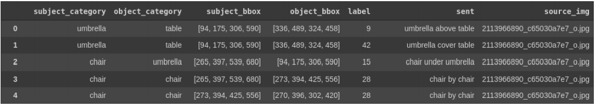
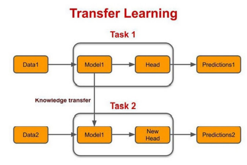
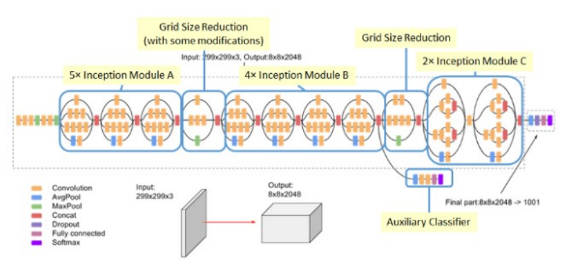
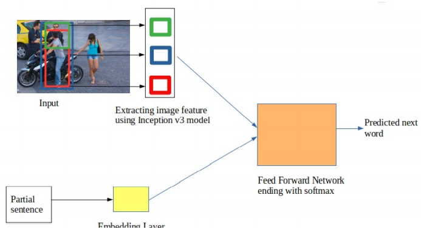
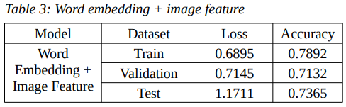
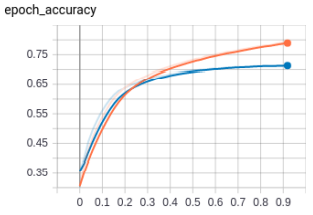
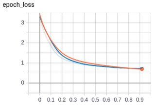

# Visual-Relationship Detection  

## Abstract  

The visual relationship detection is identifying the relations between objects in an image. The machine
learning algorithms used, require a large database as the models were trained for almost every type of
relationship, which this project tries to tackle. This project has two unique factors, 1) A model was
trained to extract the features of the objects and their relationship. 2)These extracted features were,
with a word embedding algorithm, used to train a model to detect the relationships. Hence, by creating
a language bias, the dataset required for training will be relatively small and be useful in cases where
the occurrence of a relationship is infrequent.  

## Dataset   

This project deals with a visual relationship dataset that contains 5000 images, including 37,993 relations, 100 object categories, and 70 predicate categories.  
   

## Transfer learning   

The concept of ‘Transfer learning’ was introduced to utilize the knowledge from previously trained models to train
new models, which will in turn help in solving problems like large datasets in the new model. This
concept has been used in this project.  
   

### Below two models were used along with transfer learning concept   

- Inception v3  
    
- GloVe

## Word embedding + image feature model   

  

## Model Accuracy   

### Model description  

  

### Loss graph  

  

### Accuracy   

  

To run this model,

1. Download the train files from https://drive.google.com/drive/folders/10TxM6vc8xUrSxeiX8CnwD6YFNc1nYgGR?usp=sharing.
2. Open the "Image features" file usng google colab (if creating new files for image feature).
3. Open the "Word Embedding + Image features" using google colab.
